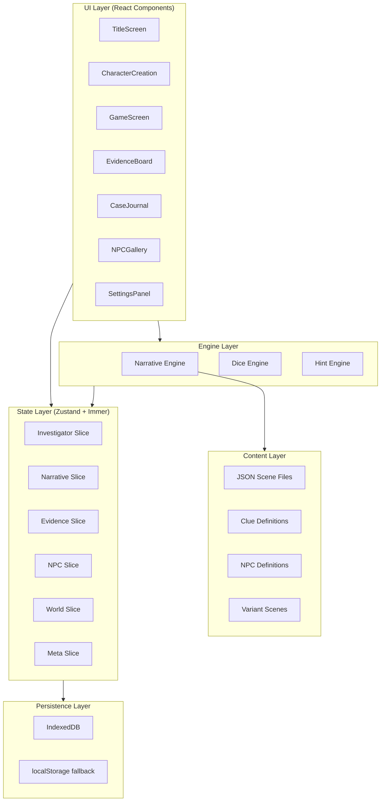
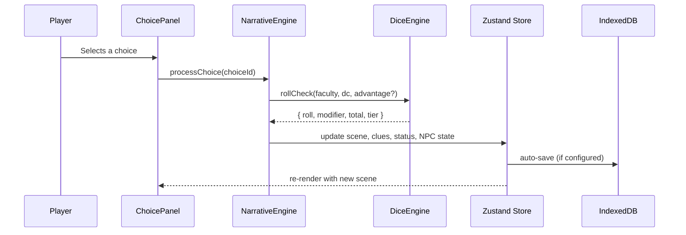

# Design Document: Gaslight & Grimoire

## Overview

Gaslight & Grimoire is a browser-based choose-your-own-adventure game set in Victorian London (1893) where players investigate branching mysteries as an Investigator with D&D-style Faculty checks and dice mechanics. The game is built with React 18+, Zustand (Immer middleware), Tailwind CSS, and a JSON-driven narrative engine.

The system is composed of several interconnected subsystems:

1. **Character Creation** — Archetype selection and Faculty point allocation (Req 1)
2. **Narrative Engine** — JSON scene graph traversal with conditional branching, variant scenes, and typewriter rendering (Req 2, 10, 17)
3. **Choice System** — Faculty-tagged choices with conditional visibility, proficiency indicators, and Advantage display (Req 3)
4. **Dice Engine** — d20 rolls with modifiers, Advantage/Disadvantage, dynamic difficulty, and five outcome tiers (Req 4)
5. **Status System** — Composure and Vitality meters with animated feedback, thresholds, and narrative consequences at zero (Req 5)
6. **Clue & Evidence System** — Clue discovery, inventory management, and the Evidence Board overlay for forming Deductions (Req 6, 7)
7. **NPC System** — Disposition, Suspicion, memory flags, and cross-case persistence (Req 8)
8. **Encounter System** — Multi-round encounters with supernatural Reaction Checks and dual-axis damage (Req 9)
9. **Case Progression** — Three-act structure, Vignettes, persistent flags, faction reputation, and variant scenes (Req 10, 19)
10. **Save/Load** — Versioned serialization to IndexedDB with localStorage fallback and migration support (Req 11)
11. **Accessibility** — Font sizing, high contrast, reduced motion, keyboard navigation, screen reader support, and cognitive aids (Req 12)
12. **Hint System** — Three-tier contextual guidance triggered by player inactivity (Req 13)
13. **Audio System** — Ambient loops and SFX with visual equivalents (Req 14)
14. **Archetype Abilities** — Once-per-Case unique abilities per Archetype (Req 15)
15. **Outcome Feedback** — Banners, clue cards, and choice telegraphing (Req 16)
16. **Title Screen & Game Flow** — Entry point with new game, load, and settings (Req 18)

## Architecture

The application follows a component-driven React architecture with a centralized Zustand store using Immer middleware for immutable state updates. The store is sliced by domain to enable selective subscriptions and prevent unnecessary re-renders.



### Key Architectural Decisions

| Decision | Rationale |
|---|---|
| Zustand over Redux | Lighter boilerplate, built-in Immer support, simpler selective subscriptions |
| Normalized state (flat ID-keyed maps) | Prevents performance degradation as clues, NPCs, and flags accumulate across cases |
| Store slicing by domain | Components subscribe only to needed data, preventing cascade re-renders |
| JSON scene graph (not hardcoded) | Content authoring is decoupled from game code; cases can be added without code changes |
| Custom Dice Engine module | Encapsulates d20 logic, Advantage/Disadvantage, dynamic difficulty — testable in isolation |
| IndexedDB primary, localStorage fallback | IndexedDB handles larger save files; localStorage provides a safety net |
| Versioned save files | Forward-compatible migrations as the data model evolves |

### Data Flow




## Components and Interfaces

### Component Hierarchy

```
<App>
├── <GameProvider>                  // Zustand store context
│   ├── <AccessibilityProvider>     // a11y settings, reduced motion, font size
│   ├── <TitleScreen />             // New game, load game, settings
│   ├── <CharacterCreation />
│   │   ├── <ArchetypeSelect />     // Four archetype cards with descriptions
│   │   └── <FacultyAllocation />   // Point distribution with live modifier display
│   ├── <GameScreen>
│   │   ├── <HeaderBar />
│   │   │   ├── <CaseTitle />
│   │   │   ├── <EvidenceBoardToggle />   // Pulses when new clues available
│   │   │   ├── <HintButton />            // Appears contextually after inactivity
│   │   │   ├── <AbilityButton />         // Archetype ability activation
│   │   │   └── <MenuButton />
│   │   ├── <NarrativePanel />
│   │   │   ├── <SceneText />             // Typewriter effect (respects reduced motion)
│   │   │   ├── <SceneIllustration />
│   │   │   ├── <DiceRollOverlay />       // Animated d20 (respects reduced motion)
│   │   │   ├── <OutcomeBanner />         // Result tier feedback (2s display)
│   │   │   └── <ClueDiscoveryCard />     // Slide-in notification (4s auto-dismiss)
│   │   ├── <StatusBar />
│   │   │   ├── <ComposureMeter />        // Animated with descriptors
│   │   │   └── <VitalityMeter />         // Animated with descriptors
│   │   └── <ChoicePanel />
│   │       └── <ChoiceCard />            // Faculty tag + proficiency color + advantage icon
│   ├── <EvidenceBoard />                 // Full-screen overlay
│   │   ├── <ProgressSummary />           // "Clues: 7/? · Deductions: 2/?"
│   │   ├── <ClueCard />                  // Draggable, with 6 status states
│   │   ├── <ConnectionThread />          // Drag-to-connect with tag highlighting
│   │   └── <DeductionButton />           // Triggers Reason check
│   ├── <CaseJournal />                   // Auto-updated case summary
│   ├── <NPCGallery />                    // Character reference with dispositions
│   ├── <SettingsPanel />                 // Accessibility, audio, save preferences
│   └── <AmbientAudio />                  // Howler.js audio manager
```

### Key Component Interfaces

**NarrativeEngine** (non-UI module):
- `loadCase(caseId: string): Promise<CaseData>` — Loads and validates all JSON files for a case
- `loadVignette(vignetteId: string): Promise<VignetteData>` — Loads vignette content
- `evaluateConditions(conditions: Condition[], state: GameState): boolean` — Checks if scene/choice prerequisites are met
- `resolveScene(sceneId: string, state: GameState): SceneNode` — Returns the correct scene (base or variant)
- `processChoice(choice: Choice, state: GameState): ChoiceResult` — Orchestrates dice roll, state updates, and next scene
- `validateContent(caseData: CaseData): ValidationResult` — Validates scene graph integrity and clue references

**DiceEngine** (pure module, no side effects):
- `rollD20(): number` — Returns integer 1–20
- `rollWithAdvantage(): { roll1: number, roll2: number, result: number }` — 2d20, take higher
- `rollWithDisadvantage(): { roll1: number, roll2: number, result: number }` — 2d20, take lower
- `calculateModifier(facultyScore: number): number` — `Math.floor((score - 10) / 2)`
- `resolveCheck(roll: number, modifier: number, dc: number): OutcomeTier` — Determines outcome tier
- `performCheck(faculty: string, investigator: Investigator, dc: number, hasAdvantage: boolean, hasDisadvantage: boolean): CheckResult` — Full check pipeline

**SaveManager** (persistence module):
- `save(state: GameState): Promise<void>` — Serializes and stores to IndexedDB (fallback: localStorage)
- `load(saveId: string): Promise<GameState>` — Loads and migrates if needed
- `listSaves(): Promise<SaveSummary[]>` — Returns available saves with timestamps
- `deleteSave(saveId: string): Promise<void>`
- `migrate(saveFile: SaveFile): SaveFile` — Applies version migrations

**HintEngine** (stateful module):
- `trackActivity(event: HintEvent): void` — Records Evidence Board visits, scene dwell time
- `shouldShowHint(): boolean` — Checks trigger conditions (3+ board visits without connection, 5+ min on scene)
- `getHint(level: 1 | 2 | 3, state: GameState): HintContent` — Returns appropriate hint text
- `resetForScene(): void` — Resets tracking on scene change


## Data Models

All data models use TypeScript interfaces. The state is normalized with flat ID-keyed maps.

### Investigator

```typescript
type Archetype = 'deductionist' | 'occultist' | 'operator' | 'mesmerist';

type Faculty = 'reason' | 'perception' | 'nerve' | 'vigor' | 'influence' | 'lore';

interface Investigator {
  name: string;
  archetype: Archetype;
  faculties: Record<Faculty, number>;  // base 8 + archetype bonus + allocated points
  composure: number;                   // 0–10
  vitality: number;                    // 0–10
  abilityUsed: boolean;                // resets per case
}
```

### Archetype Definitions

```typescript
interface ArchetypeDefinition {
  id: Archetype;
  name: string;
  description: string;
  bonuses: Partial<Record<Faculty, number>>;  // e.g. { reason: 3, perception: 1 }
  ability: {
    name: string;           // e.g. "Elementary"
    description: string;
    faculty: Faculty;       // which faculty the auto-success applies to
    context: string;        // when it can be used (e.g. "connect two clues", "escape danger")
  };
}
```

### Clue

```typescript
type ClueType = 'physical' | 'testimony' | 'occult' | 'deduction' | 'redHerring';
type ClueStatus = 'new' | 'examined' | 'connected' | 'deduced' | 'contested' | 'spent';

interface Clue {
  id: string;
  type: ClueType;
  title: string;
  description: string;
  sceneSource: string;
  connectsTo?: string[];        // valid connection target clue IDs
  grantsFaculty?: Faculty;      // which faculty gets Advantage from this clue
  tags: string[];               // location, person, substance, etc.
  status: ClueStatus;
  isRevealed: boolean;
}
```

### Deduction

```typescript
interface Deduction {
  id: string;
  clueIds: string[];            // clues that form this deduction
  description: string;          // investigator's inner monologue
  unlocksScenes?: string[];     // scene IDs unlocked by this deduction
  unlocksDialogue?: string[];   // dialogue option IDs unlocked
  isRedHerring: boolean;        // true if formed from a Red Herring clue
}
```

### NPC State

```typescript
interface NPCState {
  id: string;
  name: string;
  faction: string | null;
  disposition: number;                    // -10 to +10
  suspicion: number;                      // 0 to 10
  memoryFlags: Record<string, boolean>;
  isAlive: boolean;
  isAccessible: boolean;
}
```

### Scene Node

```typescript
interface Condition {
  type: 'hasClue' | 'hasDeduction' | 'hasFlag' | 'facultyMin' | 'archetypeIs' | 'npcDisposition' | 'factionReputation';
  target: string;
  value?: number | boolean | string;
}

interface Effect {
  type: 'composure' | 'vitality' | 'flag' | 'disposition' | 'suspicion' | 'reputation' | 'discoverClue';
  target?: string;
  delta?: number;
  value?: boolean | string;
}

interface ClueDiscovery {
  clueId: string;
  method: 'automatic' | 'exploration' | 'check' | 'dialogue';
  requiresFaculty?: { faculty: Faculty; minimum: number };
  requiresDeduction?: string;
}

interface SceneNode {
  id: string;
  act: number;
  narrative: string;
  illustration?: string;
  ambientAudio?: string;
  cluesAvailable: ClueDiscovery[];
  choices: Choice[];
  conditions?: Condition[];
  onEnter?: Effect[];
  archetypeExclusive?: Archetype;
  variantOf?: string;
  variantCondition?: Condition;
}
```

### Choice

```typescript
type OutcomeTier = 'critical' | 'success' | 'partial' | 'failure' | 'fumble';

interface Choice {
  id: string;
  text: string;
  faculty?: Faculty;
  difficulty?: number;
  dynamicDifficulty?: {
    baseDC: number;
    scaleFaculty: Faculty;
    highThreshold: number;
    highDC: number;
  };
  advantageIf?: string[];       // clue IDs that grant Advantage
  outcomes: Record<OutcomeTier, string>;  // maps tier to next scene ID
  requiresClue?: string;
  requiresDeduction?: string;
  requiresFlag?: string;
  requiresFaculty?: { faculty: Faculty; minimum: number };
  npcEffect?: {
    npcId: string;
    dispositionDelta: number;
    suspicionDelta: number;
  };
}
```

### Game State & Save File

```typescript
interface GameState {
  investigator: Investigator;
  currentScene: string;
  currentCase: string;
  clues: Record<string, Clue>;
  deductions: Record<string, Deduction>;
  npcs: Record<string, NPCState>;
  flags: Record<string, boolean>;
  factionReputation: Record<string, number>;
  sceneHistory: string[];
  settings: GameSettings;
}

interface GameSettings {
  fontSize: 'standard' | 'large' | 'extraLarge' | number;
  highContrast: boolean;
  reducedMotion: boolean;
  textSpeed: 'typewriter' | 'fast' | 'instant';
  hintsEnabled: boolean;
  autoSaveFrequency: 'choice' | 'scene' | 'manual';
  audioVolume: { ambient: number; sfx: number };
}

interface SaveFile {
  version: number;
  timestamp: string;
  state: GameState;
}
```

### Zustand Store Shape

```typescript
interface GameStore {
  // Investigator slice
  investigator: Investigator;
  updateFaculty: (faculty: Faculty, value: number) => void;
  adjustComposure: (delta: number) => void;
  adjustVitality: (delta: number) => void;
  useAbility: () => void;
  resetAbility: () => void;

  // Narrative slice
  currentScene: string;
  currentCase: string;
  sceneHistory: string[];
  goToScene: (sceneId: string) => void;

  // Evidence slice
  clues: Record<string, Clue>;
  deductions: Record<string, Deduction>;
  discoverClue: (clueId: string) => void;
  updateClueStatus: (clueId: string, status: ClueStatus) => void;
  addDeduction: (deduction: Deduction) => void;

  // NPC slice
  npcs: Record<string, NPCState>;
  adjustDisposition: (npcId: string, delta: number) => void;
  adjustSuspicion: (npcId: string, delta: number) => void;
  setNpcMemoryFlag: (npcId: string, flag: string, value: boolean) => void;
  removeNpc: (npcId: string) => void;

  // World slice
  flags: Record<string, boolean>;
  factionReputation: Record<string, number>;
  setFlag: (flag: string, value: boolean) => void;
  adjustReputation: (faction: string, delta: number) => void;

  // Meta slice
  settings: GameSettings;
  updateSettings: (partial: Partial<GameSettings>) => void;
  saveGame: () => Promise<void>;
  loadGame: (saveId: string) => Promise<void>;
}
```

### Content File Schemas

Case directory structure:
```
/content/cases/[case-name]/
  meta.json       — { id, title, synopsis, acts: number, facultyDistribution }
  act1.json       — { scenes: SceneNode[] }
  act2.json       — { scenes: SceneNode[] }
  act3.json       — { scenes: SceneNode[] }
  clues.json      — { clues: Clue[] }
  npcs.json       — { npcs: NPCState[] }
  variants.json   — { variants: SceneNode[] }

/content/side-cases/[vignette-name]/
  meta.json       — { id, title, synopsis, triggerCondition }
  scenes.json     — { scenes: SceneNode[] }
  clues.json      — { clues: Clue[] }
  npcs.json       — { npcs: NPCState[] }
```

